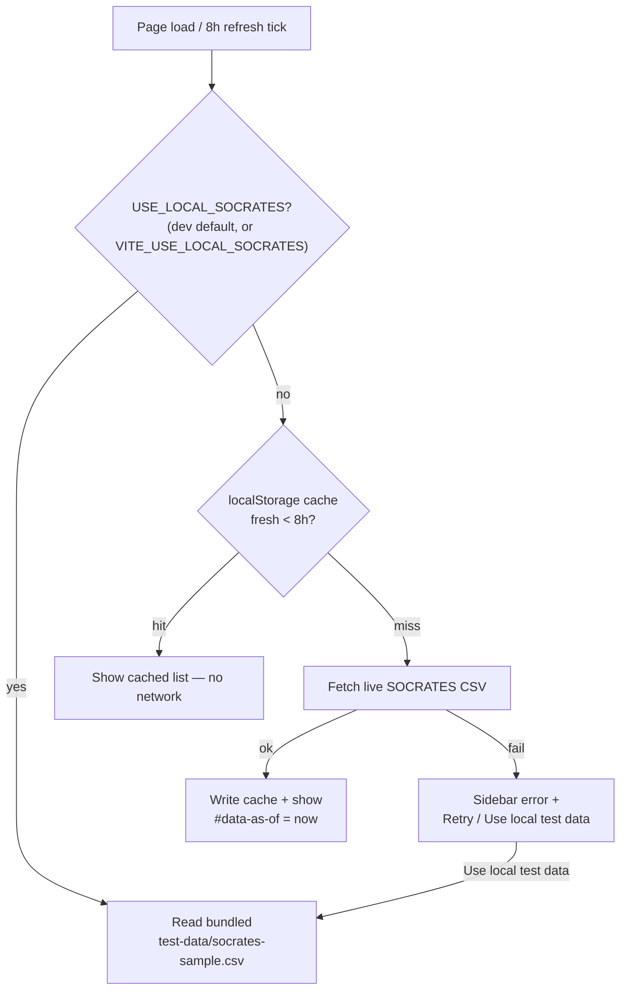
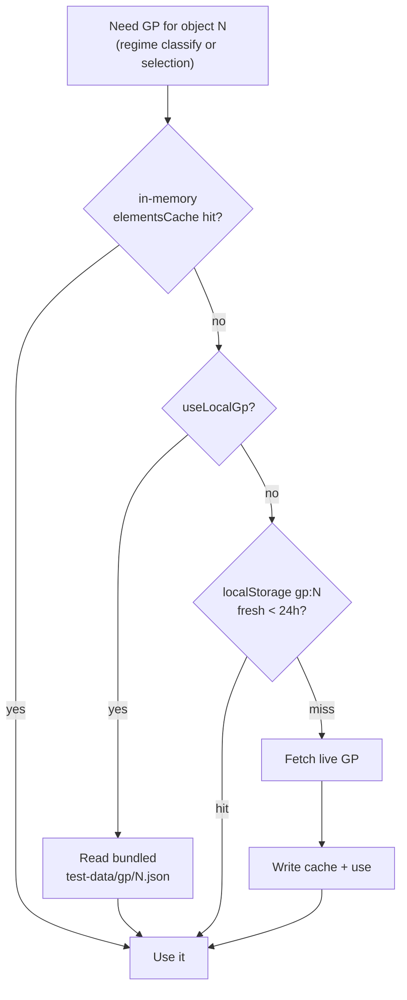

# Data flow

GRAZE pulls two kinds of data from CelesTrak, wraps them in several caching
layers, and falls back to a bundled offline snapshot when the network isn't
available. This document explains the whole strategy — what is fetched, when,
from where, and how "local" data is prioritized in each mode.

## The two data sources

| Data | Source | Format | Code |
| --- | --- | --- | --- |
| **Conjunction list** | CelesTrak SOCRATES `sort-minRange.csv` (~16 MB, all predicted conjunctions for the week, pre-sorted by ascending miss distance) | raw CSV, truncated to the top `TOP_CONJUNCTIONS` (10) | [`conjunction-core/src/socrates.ts`](../packages/conjunction-core/src/socrates.ts) |
| **Orbital elements (GP)** | CelesTrak GP API `gp.php?CATNR={id}&FORMAT=JSON` | OMM JSON, one object per request | [`conjunction-core/src/celestrak.ts`](../packages/conjunction-core/src/celestrak.ts) |

Neither needs authentication. GP is fetched lazily — once per object as the
sidebar classifies orbit regimes and again when a conjunction is selected
(deduped, see below).

## Three meanings of "local"

The word "local" shows up in three distinct roles; keeping them apart makes the
rest of this document clearer:

1. **Bundled fixtures** — `test-data/socrates-sample.csv` and
   `test-data/gp/{id}.json`, committed to the repo and served from
   `packages/conjunction-web/public/test-data/`. This is the **dev default**.
2. **The `localStorage` TTL cache** — previously-fetched *live* data persisted
   on the device so reloads don't re-hit CelesTrak.
3. **The offline fallback** — a "Use local test data" button that switches a
   live session over to the bundled fixtures when CelesTrak is unreachable.

## Two runtime modes at a glance

| | Development (`npm run dev`) | Production (built site) |
| --- | --- | --- |
| Default data | **Bundled `test-data/` snapshot** — zero CelesTrak requests | **Live CelesTrak**, via `localStorage` cache |
| Why | Spares CelesTrak's rate limiter during iteration | Real, current conjunction data |
| Request origin | Same-origin, through the Vite dev proxy (`/SOCRATES`, `/NORAD` → celestrak.org) | `https://celestrak.org` directly, or the Cloudflare Worker if `VITE_CELESTRAK_BASE` is set |
| Opt out | `VITE_USE_LIVE=true` forces live; `VITE_USE_LOCAL_*` forces bundled | n/a (always live) |
| `#data-as-of` footer | "bundled test snapshot (not live)" | the timestamp the shown data was fetched |

The switch is decided at startup in
[`conjunction-web/src/main.ts`](../packages/conjunction-web/src/main.ts):

```ts
DEV_DEFAULT_LOCAL = import.meta.env.DEV && !VITE_USE_LIVE
USE_LOCAL_SOCRATES = VITE_USE_LOCAL_SOCRATES || DEV_DEFAULT_LOCAL
useLocalGp         = VITE_USE_LOCAL_GP     || DEV_DEFAULT_LOCAL   // mutable
```

`useLocalGp` is the only mutable one: the "Use local test data" fallback flips
it to `true` mid-session so GP lookups also switch to the bundled files.

## How the conjunction list is loaded

`loadConjunctions()` runs on page load and again on an 8-hour `setInterval`
(`REFRESH_INTERVAL_MS`). The list is served from the `localStorage` cache while
it's still fresh, so a reload within the TTL makes **no** SOCRATES request (and
skips the 16 MB download).



## How orbital elements are loaded

Each object's GP set is resolved through `getElements(noradId)`, which layers an
in-memory cache over the persistent one:



Bundled reads bypass the persistent cache (which is live-only). A failed live
fetch is dropped from the in-memory cache so a retry can succeed. If a selected
object has no bundled GP file in local mode, it fails with a clean, actionable
message ("No bundled GP data for NORAD … — run npm run refresh:test-data")
rather than a raw JSON parse error.

## The caching layers

| Layer | Scope | TTL | Purpose | Code |
| --- | --- | --- | --- | --- |
| `elementsCache` | in-memory, per session | until the next 8 h list refresh | dedupe GP fetches shared by classification and selection | `main.ts` |
| `localStorage` | per device/browser | list **8 h**, GP **24 h** | survive reloads without re-hitting CelesTrak | [`cache.ts`](../packages/conjunction-web/src/cache.ts) |
| Cloudflare Worker edge cache | shared, all clients | list **8 h**, GP **24 h** (per-path) | backstop that spares CelesTrak even for cold clients with no `localStorage` yet | [`cf-worker/worker.js`](../cf-worker/worker.js) |

The `localStorage` cache (`cache.ts`) is **best-effort**: every access is
guarded, so private-mode / disabled / quota-full storage degrades to a cache
miss instead of throwing. Keys are versioned (`graze:v1:…`) so a schema change
can invalidate all entries at once. Each entry stores a `savedAt` timestamp,
which is what the `#data-as-of` footer displays.

## Priority order, summarized

- **Dev, default:** bundled fixtures only. No network at all.
- **Dev, `VITE_USE_LIVE=true` / Production:**
  1. in-memory `elementsCache` (GP only),
  2. `localStorage` cache if fresh within TTL — no network,
  3. live CelesTrak fetch (direct, proxied, or via the Worker),
  4. on failure → **Use local test data** falls back to the bundled fixtures.

## Refreshing the bundled dev data

The bundled snapshot is regenerated with a single command:

```sh
npm run refresh:test-data
```

[`scripts/refresh-test-data.mjs`](../scripts/refresh-test-data.mjs) fetches the
current SOCRATES list (just the first 64 KiB via an HTTP `Range` request — the
file is sorted, so the top rows are all we need), keeps the top `ROWS` (default
10) rows whose **both** objects have fetchable GP (CelesTrak first, then a public
TLE mirror), rewrites both `socrates-sample.csv` copies byte-identically, writes
GP for exactly those objects to both `gp/` dirs, and prunes GP files the new
list no longer references. It is non-destructive on failure: if the list can't
be fetched or a full snapshot can't be covered, it leaves the bundled files
untouched. Override with `ROWS=`, `MAX_CANDIDATES=`, `BASE=`.

## Environment flags

| Flag | Effect |
| --- | --- |
| `VITE_USE_LIVE=true` | In dev, use live CelesTrak instead of the bundled default. |
| `VITE_USE_LOCAL_SOCRATES=true` | Always read the conjunction list from the bundled snapshot (any mode). |
| `VITE_USE_LOCAL_GP=true` | Always read element sets from `test-data/gp/{id}.json` (any mode). |
| `VITE_CELESTRAK_BASE=<url>` | Production origin for CelesTrak requests — set to the Cloudflare Worker URL to route through the CORS proxy. Ignored in dev (which always proxies same-origin). |

## Key files

| Path | Role |
| --- | --- |
| [`conjunction-core/src/socrates.ts`](../packages/conjunction-core/src/socrates.ts) | Fetch + parse the SOCRATES conjunction CSV |
| [`conjunction-core/src/celestrak.ts`](../packages/conjunction-core/src/celestrak.ts) | Fetch GP element sets (OMM JSON) |
| [`conjunction-web/src/main.ts`](../packages/conjunction-web/src/main.ts) | Mode selection, load orchestration, `getElements`, fallbacks |
| [`conjunction-web/src/cache.ts`](../packages/conjunction-web/src/cache.ts) | `localStorage` TTL cache |
| [`conjunction-web/vite.config.ts`](../packages/conjunction-web/vite.config.ts) | Dev proxy for `/SOCRATES` and `/NORAD` |
| [`cf-worker/worker.js`](../cf-worker/worker.js) | Cloudflare Worker CORS proxy + edge cache |
| [`scripts/refresh-test-data.mjs`](../scripts/refresh-test-data.mjs) | Regenerate the bundled snapshot |
