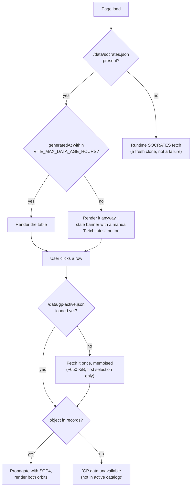

# Data flow

GRAZE serves everything it needs from two files baked at build time. The client
makes **zero CelesTrak requests for orbital elements**, and none at all on page
load. This document explains what is fetched, when, by whom, and what happens
when a piece is missing.

## The three upstream sources — all build-time

| Data | Source | Requests per build | Written to |
| --- | --- | --- | --- |
| **Conjunction list** | SOCRATES `sort-minRange.csv` + `sort-maxProb.csv` (~16 MB each, pre-sorted) | 2, each an HTTP `Range` for the first 256 KiB | `public/data/socrates.json` |
| **Orbit regimes** | `pub/satcat.csv` (whole catalogue) | 1 | folded into `socrates.json` as `regime1`/`regime2` |
| **Orbital elements (GP)** | `gp.php?GROUP=active&FORMAT=json` | 1 per group in `GP_GROUPS` | `public/data/gp-active.json` |

All three are fetched by [`scripts/fetch-socrates.mjs`](../scripts/fetch-socrates.mjs),
never by the browser. Both output files are gitignored: they are build
artifacts, not source.

Why both SOCRATES orderings: they contain the same conjunctions sorted
differently, and truncating either alone is lossy in the other dimension —
measured against live data, keeping only the 10 closest approaches dropped 6 of
the 10 highest-probability events. The bake takes the head of both and unions
them.

## What the client does


```mermaid
flowchart TD
  A["Page load"] --> B{"/data/socrates.json<br/>present?"}
  B -- yes --> C{"generatedAt within<br/>VITE_MAX_DATA_AGE_HOURS?"}
  C -- yes --> D["Render the table"]
  C -- no --> E["Render it anyway +<br/>stale banner with a manual<br/>'Fetch latest' button"]
  B -- no --> F["Runtime SOCRATES fetch<br/>(a fresh clone, not a failure)"]
  D --> G["User clicks a row"]
  E --> G
  G --> H{"/data/gp-active.json<br/>loaded yet?"}
  H -- no --> I["Fetch it once, memoised<br/>(~650 KiB, first selection only)"]
  H -- yes --> J{"object in records?"}
  I --> J
  J -- yes --> K["Propagate with SGP4,<br/>render both orbits"]
  J -- no --> L["'GP data unavailable<br/>(not in active catalog)'"]
```

**There is no per-object network path.** An object absent from `gp-active.json`
reports itself unavailable; it is never fetched individually. That per-object
lookup is the defect this pipeline exists to prevent — it once meant ~1,838
CelesTrak requests per visitor.
[`test/noRuntimeCelestrak.test.ts`](../packages/conjunction-web/test/noRuntimeCelestrak.test.ts)
fails the build if a `gp.php`/`CATNR` URL or a `fetchOrbitalElements` import
reappears in the web package.

### The coverage gap, stated plainly

`GROUP=active` excludes debris, rocket bodies, analyst tracks and decayed
payloads. Measured on a 1360-record bake: 203 of 1575 objects absent, so **405
rows (29.8%) cannot be visualized**. Those rows still carry valid SOCRATES
figures — only the 3D view needs elements, and the **Visualizable only** filter
hides them on request.

**There is no `socrates` group.** CelesTrak answers `GROUP=socrates` with
`Invalid query: ... (GROUP=socrates not found)`, verified 2026-07-30, and no
group returns the full catalogue — `SPECIAL=gpz`/`gpz-plus` are the GEO
Protected Zone. The 212 misses are 138 debris (only 41 of them inside the three
published debris-cloud groups), 35 rocket bodies and 39 inactive payloads, so
widening means adding several names to `GP_GROUPS`, one request per entry per
build.

## Dev and production are identical

There is no bundled mock. The old 10-row `test-data/` fixture was removed
because it manufactured false confidence: a dev session looked healthy against
ten hand-picked objects while proving nothing about whether the bake worked.

```sh
npm run data:fetch   # once per clone — the outputs are gitignored
npm run dev
```

Without those files, dev takes the same runtime-fallback branch production
would. If you would rather it fail than reach the network, set
`VITE_DATA_MODE=baked`, which never networks.

## Resolution order

Defined once, as a pure function, in
[`socratesSource.ts`](../packages/conjunction-web/src/data/socratesSource.ts)
(`selectSource`), so every branch is testable without a network:

1. Baked file present and fresh → use it.
2. Baked file present but stale → **render it anyway**, plus a dismissible
   banner offering a manual "Fetch latest". **Never auto-fetch**: if the
   scheduler dies, auto-fetching turns every pageview into a full CSV pull,
   exactly when nobody is watching.
3. Baked file absent → runtime fetch with a loading state.

`VITE_DATA_MODE=baked` never networks; `runtime` never reads the baked file.

Staleness is keyed on `generatedAt` — when *our pipeline* last ran — not on
CelesTrak's publication time. The question is "is the bake alive", not "has
upstream published". A separate, purely informational note appears when upstream
itself has been quiet; it is never a warning and never offers a fetch.

## Caching

| Layer | Scope | TTL | Purpose |
| --- | --- | --- | --- |
| `bakedGpPromise` | in-memory, per page | page lifetime | one `gp-active.json` fetch shared by every selection |
| `elementsCache` | in-memory, per session | until the next 8 h list refresh | dedupe element lookups per object |
| `localStorage` | per device | list **8 h** | survive reloads without re-fetching the list |

[`cache.ts`](../packages/conjunction-web/src/cache.ts) is **best-effort**: every
access is guarded, so private-mode or quota-full storage degrades to a miss
rather than throwing. GP has no `localStorage` layer — it is a single static
file served with the app's own cache headers, so there is nothing left to save.

## When data is missing

| Symptom | Meaning |
| --- | --- |
| *"GP data unavailable (not in active catalog)"* | The object is not in `GROUP=active` — expected for debris. Nothing to retry. |
| *"Baked orbital elements could not be loaded"* | `gp-active.json` is absent from the deploy. Affects every row; fixed by the next successful bake. |
| **High divergence** badge | Elements propagate to a very different miss distance than SOCRATES screened. Almost always element age across a manoeuvre — see [methodology.md](methodology.md). |

## `gp.php` rate limiting

The GP endpoint enforces a ~2-hour window per client and signals it with **403,
not 304**:

```
GP data has not updated since your last successful
download of GROUP=active at 2026-07-30 15:50:03 UTC.
Data is updated once every 2 hours.
```

`fetchCsv` treats that body as not-modified and never retries it. **Do not probe
the bulk GP endpoint by hand** — a throwaway request consumes the window and the
next real bake gets nothing for two hours.

## Environment flags

| Flag | Effect |
| --- | --- |
| `VITE_DATA_MODE=baked` | Only ever read the baked file; never network. |
| `VITE_DATA_MODE=runtime` | Ignore the baked file; always fetch at runtime. |
| `VITE_MAX_DATA_AGE_HOURS=<n>` | Staleness threshold on `generatedAt` (default 24). |
| `VITE_SOCRATES_URL=<url>` | Override the SOCRATES origin for the runtime path. |
| `STRICT_DATA=1` | Build-time only: fail the bake instead of degrading. |

## Key files

| Path | Role |
| --- | --- |
| [`scripts/fetch-socrates.mjs`](../scripts/fetch-socrates.mjs) | The whole bake: SOCRATES, SATCAT, bulk GP, the in-memory join |
| [`conjunction-core/src/socrates.ts`](../packages/conjunction-core/src/socrates.ts) | Parse the SOCRATES CSV |
| [`conjunction-web/src/data/socratesSource.ts`](../packages/conjunction-web/src/data/socratesSource.ts) | Resolution order, as a pure function |
| [`conjunction-web/src/data/gpSource.ts`](../packages/conjunction-web/src/data/gpSource.ts) | Read the baked elements; no network fallback |
| [`conjunction-web/src/cache.ts`](../packages/conjunction-web/src/cache.ts) | `localStorage` TTL cache |
| [`conjunction-web/vite.config.ts`](../packages/conjunction-web/vite.config.ts) | Dev proxy for `/SOCRATES` only |
