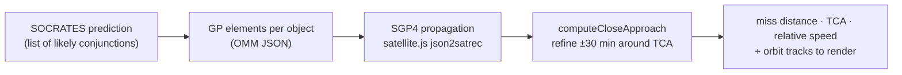

# Conjunction analysis methodology

How GRAZE turns two catalog objects into a predicted close approach, and what the
numbers on screen actually mean. All of this lives in `conjunction-core` (pure
TypeScript, no UI).

Related: [coordinate-frames.md](coordinate-frames.md) (how the result is drawn),
[data-flow.md](data-flow.md) (where the inputs come from).

> ⚠️ **Educational and awareness purposes only — not for operational conjunction
> assessment.** See [Accuracy & caveats](#accuracy--caveats).

## The pipeline

1. **CelesTrak SOCRATES** publishes the predicted conjunctions (which pairs come
   close, and roughly when). GRAZE takes the top N by miss distance.
2. For each object it fetches **GP orbital elements** in OMM JSON and builds an
   SGP4 record with `json2satrec` ([`propagator.ts`](../packages/conjunction-core/src/propagator.ts)
   `toSatrec`). **Always JSON, never TLE** — see
   [CONTRIBUTING.md](../CONTRIBUTING.md).
3. GRAZE **re-derives** the approach itself rather than trusting the predicted
   TCA verbatim (below).

## Refining the close approach

`computeCloseApproach(elements1, elements2, tca, windowMinutes = 30)`
([`propagator.ts`](../packages/conjunction-core/src/propagator.ts)) propagates
both objects across **±30 minutes** around the predicted TCA and finds the
sampled instant of minimum separation.

Sampling is **adaptive** (`buildSampleTimes`) to stay cheap without missing the
minimum of a ~15 km/s encounter:

| Region (relative to predicted TCA) | Step |
| --- | --- |
| −30 min … −2 min | 10 s (`COARSE_STEP_MS`) |
| ±2 min (`FINE_WINDOW_MS`) | **1 s** (`FINE_STEP_MS`) |
| +2 min … +30 min | 10 s |

At each step both objects are propagated; the ECI separation
(`eciDistance`) is tracked and the closest pair kept. The result
(`CloseApproachDetails`, [`types.ts`](../packages/conjunction-core/src/types.ts)):

- `actualTca` / `actualMinRange` — the refined time and minimum separation (km),
- `relativeVelocityAtTca` — magnitude of the ECI velocity difference (km/s),
- `position{1,2}AtTca` — full state (ECI + geodetic) of each object at closest approach,
- `orbit1` / `orbit2` — the sampled tracks, rendered as the two arcs.

If SGP4 fails across the whole window (decayed object, epoch too far), it throws
and the UI shows a clean "propagation failed" message instead of a broken scene.

## Orbit summary & regime

`summarizeOrbit` ([`analysis.ts`](../packages/conjunction-core/src/analysis.ts))
derives human numbers from mean motion `n` and eccentricity `e`:

- semi-major axis `a = ∛(μ / (n·2π/86400)²)` (μ = 398600.4418 km³/s²),
- apogee/perigee heights `a(1±e) − Rₑ` (Rₑ = 6378.137 km),
- period `1440 / MEAN_MOTION` minutes.

`classifyOrbitRegime` buckets each object (used by the sidebar filters):

| Regime | Rule |
| --- | --- |
| **HEO** | `e > 0.25` (checked first) |
| **LEO** | period `< 225 min` |
| **MEO** | `225–1400 min` |
| **GEO** | `> 1400 min` (super-synchronous lumped in) |

## Reading the fields

The sidebar and info panel surface these per conjunction (`ConjunctionEvent`,
[`types.ts`](../packages/conjunction-core/src/types.ts)); the wording matches the
in-app tooltips ([`ui/tooltipText.ts`](../packages/conjunction-web/src/ui/tooltipText.ts)):

| Field | Meaning |
| --- | --- |
| **TCA** | Time of Closest Approach — UTC instant the two objects are nearest. |
| **Miss distance** | Predicted closest separation at TCA, km (`TCA_RANGE`). GRAZE labels its own refined value and notes the SOCRATES figure alongside. |
| **Relative speed** | Closing speed at TCA, km/s — most LEO encounters are ~7–15 km/s. |
| **Max probability (Pc)** | Estimated chance the two objects collide, from position uncertainty. Higher = greater risk; indicative only (below). |
| **Object type** | Payload · Debris (name contains `DEB`) · R/B (rocket body, `R/B`), via `classifyObjectType`. |
| **DSE** | Days since the element set's epoch, at TCA (`dse1` / `dse2`). A **staleness** indicator — large DSE means the elements are old and the prediction less trustworthy. |
| **Dilution** | SOCRATES dilution factor — a geometry/uncertainty measure carried through from the source data. |

## Accuracy & caveats

GRAZE is a **visualizer built on public data**, not a screening tool:

- **SGP4 is a general-perturbations model** with limited fidelity; it is not a
  precise numerical ephemeris.
- **Public GP elements are only as fresh as their epoch** — watch DSE. Stale or
  low-quality element sets can move a predicted miss by kilometers.
- **Pc here is indicative.** GRAZE has no covariance data, so it cannot compute a
  rigorous probability of collision; treat it as relative risk, not an operational
  number.
- Real conjunction assessment uses owner/operator ephemerides, covariances, and
  screening pipelines. **Do not use GRAZE for collision avoidance.**
